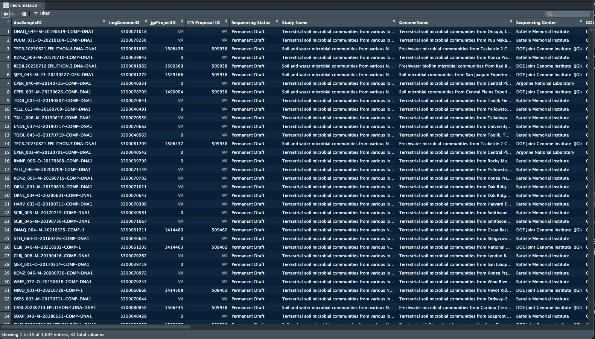
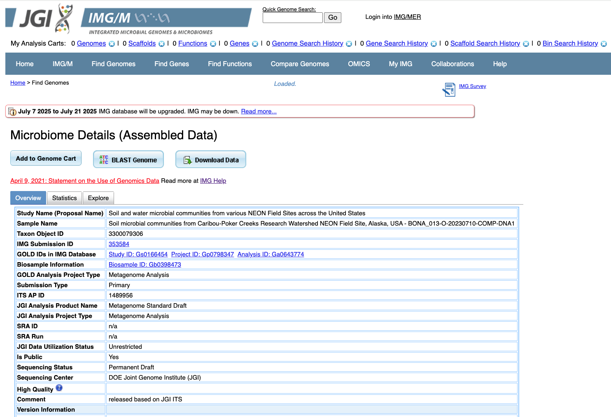
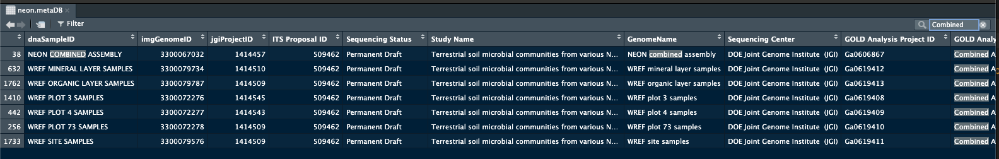

.. _metagenomic-section:

NEON metagenomic data
==========================================

We have provided some tools and guidelines to help users access NEON metagenomic data on the JGI and NMDC data portals.

NEON metagenome database
------------------------

A table (``neon.metaDB``) has been added to the phyloNEON package that contains over 1,800 NEON metagenome samples that are on the JGI IMG data portal. This includes legacy data as well as all samples that are part of the `JGI CSP award <https://www.neonscience.org/impact/observatory-blog/update-changing-neon-microbial-data>`__, which covers deep sequencing and analysis by JGI of all NEON metagenome samples collected in 2023 and 2024. Included in the table are several fields with JGI metadata and statistics for each sample, such as **Sequencing Method**, **GenomeSize**, **GeneCount**, and number of bins (**metaBATbinCount**). Also included are some NEON variables such as **siteID** and **collectDate**, as well as multiple environmental terms assigned to each sample according to ENVO specifications (e.g. **Ecosystem Category**, **Ecosystem Type**, **Specific Ecosystem**). The table also has reference codes for the Genome Online Database (GOLD), including **GOLD Analysis Project ID** and **GOLD Study ID**; and the taxon OID (**imgGenomeOID**) that allows accessing the sample on the JGI IMG data portal.

This table is available when you load the package:

.. code-block:: console

    library(phyloNEON)

    View(neon.metaDB)

Here is a partial view of the table: 

You can search the table to find NEON samples that are on JGI.

Opening web pages on the JGI IMG data portal 
--------------------------------------------

We have added a function, ``openIMG`` on this package that enables the user to search the **neon.metaDB** database and open the landing page for each sample (limited to 15 queries at a time). The user just needs to input the **dnaSampleID** or list of **dnaSampleIDs** to the function, and the page will open in the default browser on your computer:

.. code-block:: console

    library(phyloNEON)

    openIMG('BONA_013-O-20230710-COMP-DNA1')

You should see the taxon oid page open: 

You can also search the **neon.metaDB** database to find lists of samples that you would like to explore on the IMG data portal. 

For example, if you want to find NEON samples from the **BONA** site that have ten or more bins, you can use the `tidyverse <https://www.tidyverse.org/>`__ package to filter the database:

.. code-block:: console

    library(phyloNEON)
    library(tidyverse)

    query1 <- neon.metaDB %>%
        dplyr::filter(siteID == 'BONA') %>%
        dplyr::filter(metaBATbinCount > 10)

    dim(query1) 
    # [1] 11 32

    # you need to input a list, so specify the dnaSampleID of your query:
    openIMG(query1$dnaSampleID)

The function should open 11 webpages in your default browser, one for each NEON sample queried.

As a little more involved example, if you wanted to bring up the webpages for all samples sequenced from the Wind River NEON site (WREF) in 2021. In this example, the tidyverse command ``pull`` is added, which will result in a vector of just the dnaSampleIDs. 

.. code-block:: console

    library(phyloNEON)
    library(tidyverse)

    query2 <- neon.metaDB %>%
        dplyr::filter(siteID == 'WREF') %>%
        dplyr::filter(as.Date(collectDate, "%Y%m%d") > '2021-01-01' & as.Date(collectDate, "%Y%m%d") < '2021-12-31') %>%
        dplyr::pull(dnaSampleID)

    # check how many samples (using length() this time)
    length(query2) 
    # [1]  7

    # open the pages \for each site. Note here the query is a vector so we \do not have to input query2$dnaSampleID
    openIMG(query2)

About a third of the NEON samples on the JGI portal were sequenced by JGI and have much increased depth compared to the older samples. 
If you wanted to focus on these samples, you can filter them by **Sequencing Center** or **ITS Proposal ID**:

.. code-block:: console

    query3 <- neon.metaDB %>%
        dplyr::filter(`Sequencing Center` == 'DOE Joint Genome Institute  (JGI)')

    # or by ITS Proposal ID

    query3a <- neon.metaDB %>%
        dplyr::filter(`ITS Proposal ID` %in% c('509938','509462'))

You can use tidyverse as well as other R packages to search the table and create a list of samples. 

NEON co-assemblies
------------------

In the pilot phase of the collaboration with JGI, several combined assemblies of NEON samples were done. These are also listed in **neon.metaDB**

Here is how you can filter the table for the co-assemblies and access. The **dnaSampleID**'s for the combined assemblies is different from the rest, as it is composed of more than one sample. But you can still open the IMG pages, either separately or as a group. 

.. code-block:: console

    library(phyloNEON)
    library(tidyverse)

    # open a single co-assembly IMG page:
    openIMG('NEON COMBINED ASSEMBLY')

    # or filter the database and open them all
    neon.coassemblies <- neon.metaDB %>%
        dplyr::filter(`GOLD Analysis Project Type` == 'Combined Assembly')

    openIMG(neon.coassemblies$dnaSampleID)

These examples should help you get started. Please open an issue on this repo if you have questions

Genomes Online Database (GOLD)
------------------------------

The Genomes Online Database is a web resource for comprehensive access to information regarding genome and metagenome sequencing projects, and associated metadata. There are four main GOLD IDs associated with every NEON metagenome sample: GOLD Study ID, GOLD Biosample ID, GOLD Sequencing Project ID, and the GOLD Analysis Project ID.  

NEON metagenome samples are split across three GOLD Study IDs: 

+---------------+-------------------------------------------+-----------------------------------------------------------------------------------------------------+
| GOLD Study ID | NEON samples included                     | Study Name                                                                                          |
+===============+===========================================+=====================================================================================================+
| `Gs0166454`_  | Samples from CSP (2023-2024)              | Soil and water microbial communities from various NEON Field Sites across the United States Samples |
+---------------+-------------------------------------------+-----------------------------------------------------------------------------------------------------+
| `Gs0161344`_  | Samples from JGI pilot study              | Terrestrial soil microbial communities from various NEON sites located in USA and Puerto Rico       |
+---------------+-------------------------------------------+-----------------------------------------------------------------------------------------------------+
| `Gs0144570`_  | All NEON legacy samples (2022 and before) | Terrestrial soil microbial communities from various locations - NEON                                |
+---------------+-------------------------------------------+-----------------------------------------------------------------------------------------------------+

.. _Gs0166454: https://gold.jgi.doe.gov/study?id=Gs0166454

.. _Gs0161344: https://gold.jgi.doe.gov/study?id=Gs0161344

.. _Gs0144570: https://gold.jgi.doe.gov/study?id=Gs0144570

list table 

.. list-table:: NEON GOLD Study IDs 
    :widths: 20 20 60
    :header-rows: 1

    * - GOLD Study ID
      - NEON samples included 
      - Study Name 
    * - Gs0166454
      - from CSP (2023-2024)
      - Soil and water microbial communities from various NEON Field Sites across the United States Samples
    * - Gs0161344
      - JGI pilot study
      - Terrestrial soil microbial communities from various NEON sites located in USA and Puerto Rico
    * - Gs0144570
      - All NEON legacy samples (2022 and before)
      - Terrestrial soil microbial communities from various locations - NEON 

board games table example 

.. list-table:: Board games
  :widths: 20 15 65
  :header-rows: 1

  * - Name
    - Number of players
    - Description
  * - Catan
    - 3 to 4
    - Players take on the roles of settlers, each attempting to build and
      develop holdings while trading and acquiring resources. Players gain
      victory points as their settlements grow and the first to reach a set
      number of victory points, typically 10, wins.
  * - Ticket to Ride
    - 2 to 5
    - Players collect and play train car cards to claim train routes across the
      map. Points are earned based on the length of the claimed routes, whoever
      completes the longest continuous railway, and whether the player can
      connect distant cities which are determined by drawing ticket cards.
  * - Chess
    - 2
    - An abstract strategy game that involves no hidden information and no
      elements of chance. Today, chess is one of the world's most popular games
      played by millions of people worldwide.
